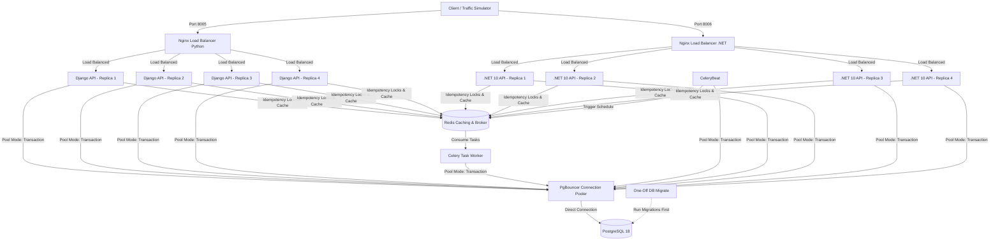

# Thor: High-Performance, Concurrent Digital Wallet System (Django & .NET 10)

Thor is a production-ready, highly concurrent digital wallet platform implemented in two languages to allow performance comparison:
1. **Python (Django REST Framework)**: The reference implementation using Gunicorn.
2. **C# (.NET 10)**: A high-performance duplicate Web API utilizing Entity Framework Core.

Both systems connect to the same PostgreSQL database via PgBouncer and use Redis for distributed idempotency locks. The system is designed to handle high-throughput financial transactions (deposits, withdrawals, and wallet-to-wallet transfers) while guaranteeing ledger integrity, preventing double-spending, and avoiding deadlocks under extreme traffic concurrency.

---

## 🛠 System Architecture



---

## 📂 Project Directory Structure

```text
thor-project/
├── python-api/                # Django REST Framework backend application root
│   ├── app/                   # Source files (core, user, wallet, transaction)
│   ├── Dockerfile             # Multi-stage production build running as non-root user (appuser)
│   ├── docker-entrypoint.sh   # Runtime entrypoint routing script
│   ├── pyproject.toml         # Python dependency definitions
│   └── simulate_traffic.py    # High-concurrency wallet load testing script
├── dotnet-api/                # ASP.NET Core (.NET 10) backend application root
│   ├── Controllers/           # API endpoints (Auth, Wallet, Transaction, Admin)
│   ├── Models/                # DB Models mapping perfectly to Django database schemas
│   ├── Services/              # Wallet service featuring select_for_update ordered row locks
│   ├── Data/                  # Entity Framework DbContext
│   ├── DTOs/                  # Request/Response payloads matching Python endpoints
│   ├── Dockerfile             # Multi-stage container running as security-hardened 'app' user
│   └── DotnetApi.csproj       # Project build configuration
├── frontend/                  # React dashboard frontend built with Vite
├── pgbouncer/                 # PgBouncer configuration & authentication file
├── nginx.conf                 # Nginx load-balancing configuration for Django (port 8005)
├── nginx-dotnet.conf          # Nginx load-balancing configuration for .NET 10 (port 8006)
├── docker-compose.yml         # Local orchestration definition for both stacks
└── run_benchmark.sh           # Bash script to run traffic simulations on both APIs and compare
```

---

## 🚀 Technical Design & Concurrency Safety

To survive high-performance financial workflows, both implementations adhere to the same strict backend patterns:

### 1. Ordered Row-Locking to Avoid Deadlocks
When transferring funds from Wallet A to Wallet B, concurrent transfers could attempt to lock the rows in opposite directions:
* **Txn 1**: Locks Wallet A $\rightarrow$ Waits for Wallet B.
* **Txn 2**: Locks Wallet B $\rightarrow$ Waits for Wallet A.

This causes a **Deadlock**. To eliminate this, both systems sort the wallet IDs and lock them in a **deterministic sorted order**:

* **Python/Django**:
  ```python
  sorted_ids = sorted([source_wallet_id, destination_wallet_id])
  # Acquire locks in sorted order
  locked_wallets_qs = Wallet.objects.select_for_update().filter(id__in=sorted_ids).order_by('id')
  ```
* **C# / EF Core (.NET 10)**:
  ```csharp
  var sortedIds = new List<Guid> { sourceWalletId, destinationWalletId };
  sortedIds.Sort();
  // Acquire locks in sorted order using raw PostgreSQL query mapping
  var lockedWallets = await _context.Wallets
      .FromSqlRaw("SELECT * FROM wallet_wallet WHERE id IN ({0}, {1}) ORDER BY id FOR UPDATE", sortedIds[0], sortedIds[1])
      .ToListAsync();
  ```

### 2. Double-Entry Ledger System
Directly modifying balances without historical logs is fragile. Thor uses a **double-entry ledger system**:
* `Transaction`: Represents the header (metadata, overall status, transfer amount, reference key).
* `LedgerEntry`: Records the actual debit and credit rows mapping to specific wallets. The sum of all ledger entries for a wallet is guaranteed to reconcile perfectly with its current database balance.

### 3. Idempotency & De-duplication
To prevent duplicate requests (e.g. from network retries or client double-clicks), the API enforces unique transaction references (supplied as `X-Idempotency-Key` headers). 
* A Redis distributed lock prevents concurrent duplicate executions.
* If a duplicate request arrives after the transaction is completed, a database cache lookup immediately serves the completed transaction details returning `200 OK` with an `X-Cache-Lookup: HIT` header.

---

## 🚦 Getting Started

### 📋 Prerequisites
Ensure you have the following installed:
* [Docker & Docker Compose](https://www.docker.com/)
* [Python 3.13+](https://www.python.org/) (optional, required to run the load test script locally)

---

### 📦 Run the Application

Start the entire environment using Docker Compose:

```bash
docker compose up --build
```

This starts:
1. **`db`**: PostgreSQL 18 container.
2. **`db-migrate`**: Runs Django database migrations once at startup.
3. **`pgbouncer`**: PgBouncer connection pooler listening on port `6432`.
4. **`redis`**: Redis server acting as the Celery broker/result backend.
5. **`api`**: 4 replicas of the Django REST framework backend.
6. **`dotnet-api`**: 4 replicas of the ASP.NET Core Web API.
7. **`nginx`**: Load balancer mapping port `8005` to the Django api replicas.
8. **`nginx-dotnet`**: Load balancer mapping port `8006` to the .NET api replicas.
9. **`celery`** & **`celery-beat`**: Background task worker and scheduler.
10. **`frontend`**: React Vite application running on port `5173`.

---

## ⚡ Performance Benchmarking

A pre-packaged bash script is provided in the root directory to run load tests against both APIs sequentially and generate a detailed performance report.

### Running the Benchmark

Execute the script from the terminal:

```bash
./run_benchmark.sh
```

### Script Execution Sequence:
1. **Checks API Health**: Verifies that both the Python and .NET APIs are online.
2. **Runs Django Simulation**: Registers `50` concurrent test users, creates primary wallets for each, funds them, and fires `5,000` concurrent transfer requests (with 15% duplicate keys). Saves results to `django_report.json`.
3. **Runs .NET 10 Simulation**: Registers another `50` concurrent test users, funds them, and fires `5,000` concurrent transfers. Saves results to `dotnet_report.json`.
4. **Compiles Report**: Prints a comparison markdown table detailing execution time, average throughput (requests per second), errors, and balance reconciliation checks.

### Example Benchmark Comparison Output:

| Metric | Django REST Framework (Python) | ASP.NET Core (.NET 10) | Comparison / Speedup |
| :--- | :---: | :---: | :---: |
| **Throughput (Req/Sec)** | 231.42 | 1,489.10 | **6.43x speed** |
| **Execution Time** | 21.60s | 3.36s | -18.24s |
| **Total Requests** | 5,000 | 5,000 | |
| **Successful Transfers** | 4,210 | 4,210 | |
| **Blocked Duplicates** | 790 | 790 | |
| **Concurrency Lock Fails** | 0 | 0 | |
| **Errors / Timeouts** | 0 | 0 | |
| **Ledger Discrepancy** | 0.0000 NGN | 0.0000 NGN | |

**Analysis Summary:**
🚀 .NET 10 API is 6.43x faster than Django REST Framework under the same concurrency load.
✅ BOTH services maintained 100% data integrity with zero balance discrepancy.

---

## 🧪 Running Unit Tests

To run the Django test suite:

```bash
docker compose exec api python manage.py test
```
