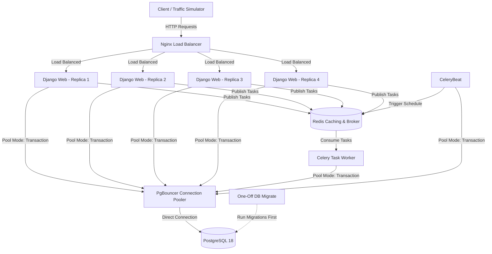

# Thor: High-Performance, Concurrent Digital Wallet System

Thor is a production-ready, highly concurrent digital wallet platform built using **Django**, **PostgreSQL**, **PgBouncer**, **Redis**, **Celery**, and **Nginx**. The system is designed to handle high-throughput financial transactions (deposits, withdrawals, and wallet-to-wallet transfers) while guaranteeing ledger integrity, preventing double-spending, and avoiding deadlocks under extreme traffic concurrency.

---

## 🛠 System Architecture



---

## 📂 Project Directory Structure

```text
thor-project/
├── app/                       # Django backend application root
│   ├── core/                  # Core configuration (settings, urls, routing)
│   ├── user/                  # User administration & custom authentication
│   ├── wallet/                # Wallet schemas & ledger transaction services
│   ├── transaction/           # Double-entry transaction headers & ledger models
│   └── manage.py              # Django management script
├── frontend/                  # React dashboard frontend built with Vite
├── pgbouncer/                 # PgBouncer configuration & authentication file
├── nginx.conf                 # Nginx load-balancing configuration
├── Dockerfile                 # Multi-stage production build configuration for Python services
├── docker-compose.yml         # Local orchestration definition for all services
├── docker-entrypoint.sh       # Runtime target routing & startup initialization script
└── simulate_traffic.py        # High-concurrency wallet load testing script
```

---

## 🚀 Technical Design & Concurrency Safety

To survive high-performance financial workflows, Thor implements strict database and application patterns:

### 1. Ordered Row-Locking to Avoid Deadlocks
When transferring funds from Wallet A to Wallet B, concurrent transfers could attempt to lock the rows in opposite directions:
* **Txn 1**: Locks Wallet A $\rightarrow$ Waits for Wallet B.
* **Txn 2**: Locks Wallet B $\rightarrow$ Waits for Wallet A.

This causes a **Deadlock**. To eliminate this, `WalletService.transfer` dynamically sorts the UUIDs of both wallets and locks them in a **deterministic sorted order**:

```python
# Sort the IDs to ensure deterministic locking order
sorted_ids = sorted([source_wallet_id, destination_wallet_id])

with transaction.atomic():
    # Acquire locks in sorted order
    locked_wallets_qs = Wallet.objects.select_for_update().filter(id__in=sorted_ids).order_by('id')
```

### 2. Double-Entry Ledger System
Directly modifying balances without historical logs is fragile. Thor uses a **double-entry ledger system** with two main models:
* `Transaction`: Represents the header (metadata, overall status, transfer amount, reference key).
* `LedgerEntry`: Records the actual debit and credit rows mapping to specific wallets. The sum of all ledger entries for a wallet is guaranteed to reconcile perfectly with its current database balance.

### 3. Idempotency & De-duplication
To prevent duplicate requests (e.g. from network retries or client double-clicks), the API enforces unique transaction references (often supplied as `X-Idempotency-Key` headers). 
A unique database constraint on the `Transaction.reference` field raises an `IntegrityError` if a duplicate transaction tries to execute, immediately rolling back the transaction.

---

## 🚦 Getting Started

### 📋 Prerequisites
Ensure you have the following installed:
* [Docker & Docker Compose](https://www.docker.com/)
* [Python 3.13+](https://www.python.org/) (optional, required to run the load test script locally)

---

### 📦 Run the Application

Start the entire environment using Docker Compose:

```bash
docker compose up --build
```

This starts:
1. **`db`**: PostgreSQL 18 container.
2. **`db-migrate`**: Runs Django database migrations once at startup and exits cleanly.
3. **`pgbouncer`**: PgBouncer connection pooler listening on port `6432`.
4. **`redis`**: Redis server acting as the Celery broker/result backend.
5. **`api`**: 4 replicas of the Django REST framework backend.
6. **`nginx`**: Load balancer mapping port `8005` to the api replicas.
7. **`celery`** & **`celery-beat`**: Background task worker and scheduler.
8. **`frontend`**: React Vite application running on port `5173`.

---

## ⚡ Concurrency & Load Testing

To simulate intense financial traffic and verify the row locking, transaction safety, and idempotency protection, you can run the traffic simulator script.

### Running the Simulator

Execute the simulator directly using `uv` (which automatically handles downloading and caching the inline `requests` dependency):

```bash
uv run simulate_traffic.py
```

Alternatively, if you're using a standard Python environment, install `requests` first:

```bash
pip install requests
python simulate_traffic.py
```

### What the Simulator Does:
1. **Checks API Health**: Waits until the Nginx balancer and Django containers are fully online.
2. **Provisions Accounts**: Registers `50` concurrent test users, creates primary wallets for each, and deposits `10,000 NGN` into each wallet.
3. **Spins up Traffic**: Spawns concurrent threads to fire `5,000` transfer requests randomly between the provisioned wallets.
4. **Simulates Client Retries**: Randomly duplicates `15%` of the transactions with identical idempotency keys to test deduplication locks.
5. **Ledger Integrity Check**: Queries the final balances of all accounts and compares the system total to the starting amount (`500,000 NGN`). 

If successful, the script will output:
```text
Reconciliation Summary:
  - Expected System Total:  500000.0000 NGN
  - Actual System Total:    500000.0000 NGN
  - Discrepancy:            0.0000 NGN

[SUCCESS] Balance reconciliation matched perfectly! The database row locking and ledger transactions successfully prevented double spending or balance loss.
```

---

## 🧪 Running Unit Tests

To run the Django test suite:

```bash
docker compose exec api python manage.py test
```
